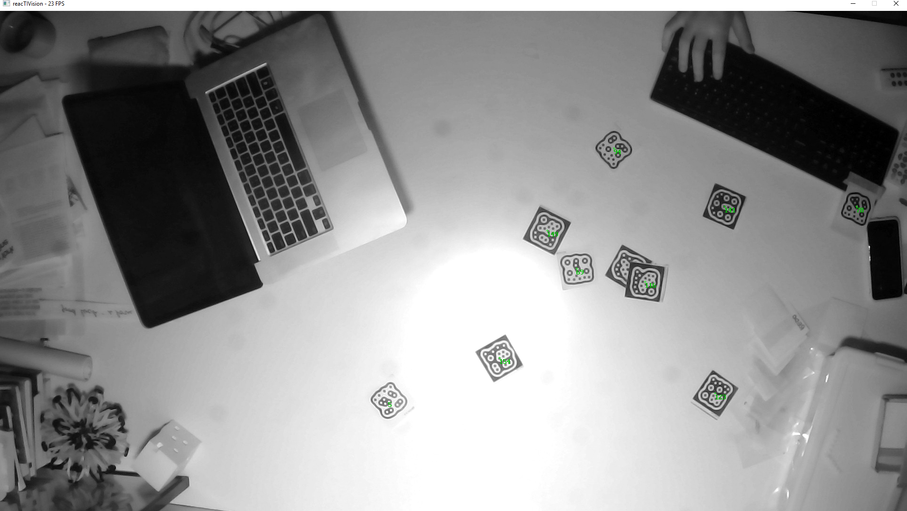

# PaperHopper

PaperHopper is a medium for prototyping new architectural design tools.

 
 

Initially developed with _Metatool_, a class taught at Columbia GSAPP in Fall 2018. Students are asked to brainstorm and create experimental environments that altered their design process.

Heavily inspired by [Dynamicland](https://dynamicland.org/).

Developed to be used with Rhino/Grasshopper, PaperHopper is somewhere between tool and medium. It is also very much a prototype.

**This documentation is in progress.**

## Goals / thoughts / motives

Let's imagine that _computing_ and _designing_ is an activity that happens in a medium. 

On a wider scale, this medium is made of objects, computer screens, paper, 3d models, software, discussion, pinups, verbal critiques, markup drawings, emails, social norms, and things that [from a long way off look like flies](https://en.wikipedia.org/wiki/Celestial_Emporium_of_Benevolent_Knowledge).[1] 

Architectural design or computational design often happens in the context of computer screens and 3d modeling software. What would it be to knit together another medium that consists of physical objects, social interaction, computational models, and tangible space?

PaperHopper's interests are adjacent to Dynamicland, where they are wonderfully trying to create a building that is a computational medium. PaperHopper is a prototyping medium designed so that students/people can play with a physical table as a computational prototyping medium for creating new architectural design tools.

## Setup

### Hardware

Required hardware:
- A table with a light-ish surface. The maximum size will depend on the projector throw distance and the webcam angle of view.
- Webcam.
  - The more resolution, the better, and also the slower. 1920x1080 at 24fps is ideal. The Logitech Brio is a stellar webcam.
  - The webcam may need some modification to make it into an infrared webcam.
- Projector. 
  - The more lumens, the better. Having a throw ratio of around 0.5 - 1.2 is necessary to get a wide image with a short distance.
- A fast computer with very good CPU clock speed. 
  - This is important. Grasshopper works on the CPU, and is mostly single-threaded. Ideally, an i5 or i7 equivalent CPU within the past two years is ideal. GPU does not really matter as long as it is a decent one.
- People.

For a specific shopping list that worked for me, see this [list of items](https://docs.google.com/spreadsheets/d/1tFv3VUJZiyRCH8n7jS4gtuZnIcmBaqbA_QOup9PwAbg/edit#gid=0).

### Software setup for Camera-only mode.

  - Download this repo. Everything for PaperHopper is in the `PaperHopper/` subfolder.

##### Reactivision 

  - In the `reacTIVision-1.5.1-win64/` folder, run `reacTIVision.exe`. You should see a screen pop up, showing a processed black-and-white view of the webcam.
    - (This is the same code from `http://reactivision.sourceforge.net/`, just with some settings pre-tweaked for convenience.)
  - If Windows alerts you that reactivision wants to communicate over the network, let it do so.
  - Print out a sheet of fiducial markers from (http://reactivision.sourceforge.net/data/fiducials.pdf), or load it on your phone, and test to see if Reactivision recognizes it. You should see small green numbers in the middle of each markers if so.

  - Great!

#### Grasshopper/Rhino

##### 1. Hardware: 
 - This assumes your hardware is setup! This means:
  - A projector facing down onto a white-ish table
  - A USB webcam (preferably an infrared camera) pointing down to that same table

##### 2. Rhino:
 - Open the `Paperhopper_3dm_TEMPLATE.3dm` file in Rhino.
 - In `Display Options`, import the `Paperhopper_Display_Mode.ini` file, which just creates a viewport style called 'PaperHopper'. The background is black, and some other small details are tweaked.
 - Load the Named View `PaperHopper` view.
 - Run `ToggleFloatingViewport` to make sure that a floating viewport exists. 
 - Drag this to your projector and maximize it, effectively using this as a canvas.

##### 3. Calibration:
 - First open the `Paperhopper_1_CALIBRATION.gh` file in Grasshopper. This will help you calibrate the system. 
   - Make sure that you don't have other Paperhopper-related definitions open. Reactivision sends data to Grasshopper over the network, and only one process can be listening to that data at a time.
 - If Grasshopper warns you about missing plugins, the relevant plugins are in the folder `gh_plugins/`. They are:
   - [Human](https://www.food4rhino.com/app/human)
   - [gHowl](https://www.food4rhino.com/app/ghowl)
   - [Bengesht](https://www.food4rhino.com/app/bengesht)
   - [Lunchbox](https://www.food4rhino.com/app/lunchbox)
   - [Telepathy](https://www.food4rhino.com/app/telepathy)
 - Follow the instructions in the Rhino window (essentially press the large pink button and move a single fiducial marker around).
 - When your calibration is done, Grasshopper saves a `Calibration.csv` file locally to the same folder.
 
##### 4. Run CoordinateTranslator

  - A python file does the coordinate translation as a separate process. You should have python installed. 
  - Run `pip install python-osc` to install the pythonosc library.
  - Run `python CoordinateTranslator.py`.
  
##### 5. Play!

 - Close all other definitions. 
 - Open `Paperhopper_2_PLAY_TEMPLATE.gh`.
 - It should be working! If it doesn't, delete and undo (undelete) the UDP component.
 - The basic component to use is the `Find Tags by ID` component.

 -This means that you can ask Grasshopper to find a tag by a certain ID, and then when the tag is visible, get its rotation amount, or trigger a Rhino command, et cetera.

## License

This repo is licensed under GNU General Public License v3.0.

Basically: Let's share everything!

## Other notes

### How the calibration works

There are two different types of coordinates: **camera coordinates** and **screen/projector coordinates**

(In a more sophisticated systems, there might be three: **camera**, **3dworld**, and **projector** coordinates.)

**Camera coordinates** are the coordinate space of the camera. So, if a marker is placed on a table, and when the camera looks at it, it's towards the lower right hand corner of the camera, and lets say that the camera is a 720p camera (1280×720px), then maybe the marker is at (1000, 600)px coordinates, from the persepective of the camera.

**Screen/projector coordinates** is the coordinate space of the projector. If the marker is placed on a table, and the projector is a 1080p projector (1920x1080px), then let's say that if the projector projects a dot at (1700, 800), it will hit the marker.

The calibration routine asks the operator to place the marker at four known screen/projector locations that form a quadrilateral. Let's call them points A_proj, B_proj, C_proj, D_proj. When the operator places the marker, the calibration routine and records the marker locations -- let's call the points A_cam, B_cam, C_cam, D_cam. This way, we have four points in physical space that are recorded with both their camera and screen/projector coordinates. 

For example, for a point on the lower-left side of the table, we have it in screen/projector space (A_proj) and in camera space (A_cam).

We then need to do a transformation between camera coordinates and projector coordinates. This transformation is a *colinear perspective transformation*, or a [*homography mapping*](https://en.wikipedia.org/wiki/Homography) from one quadrilateral to another. In general, these transformations work by creating a transform matrix from one quad to another, and then multiplying a point on the first quadrilateral by the matrix to find the second point.

Thus, we can go from camera coordinates to projector coordinates, and vice versa.

This is one such way to perform a colinear perspective transformation in Python:
https://stackoverflow.com/a/24088499

Another solution is implemented inside `Paperhopper_1_CALIBRATION.gh` and `CoordinateTranslator.py`. `Paperhopper_1_CALIBRATION.gh` performs the calibration and saves the transformation matrix as `calibration.csv`; `CoordinateTranslator.py` then reads this calibration.csv file, loads the transformation matrix, receives messages from Reactivision, and passes them onto `Paperhopper_2_PLAY_TEMPLATE.gh`, etc.

## Footnotes

[1] I will note that I feel somewhat uncomfortable about this Borges reference, because it partially relies/amplifies the 'inscrutable asian' stereotype; is it celebratory or exoticizing a taxonomic order that has a confusing, inscrutable logic? Both.
