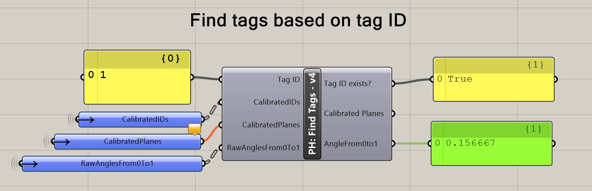

# PaperHopper

PaperHopper is a prototype medium for experimenting with how our environment changes how we design.

Initially developed with _Metatool_, a class taught at Columbia GSAPP in Fall 2018. Students are asked to brainstorm and create experimental environments that altered their design process.

Heavily inspired by [Dynamicland](https://dynamicland.org/).

Developed to be used with Rhino/Grasshopper, PaperHopper is somewhere between tool and medium. It is also very much a prototype.

**[Download v0.1 as a zip file.](https://github.com/dantaeyoung/PaperHopper/archive/v0.1.zip)**

## Setup

### Hardware

Required hardware:
- A table with a light-ish surface. The maximum size will depend on the projector throw distance and the webcam angle of view.
- People
- Webcam.
  - The more resolution, the better, and also the slower. 1920x1080 at 24fps is ideal. The Logitech Brio is a stellar webcam.
  - The webcam may need some modification to make it into an infrared webcam.
- Projector. 
  - The more lumens, the better. Having a throw ratio of around 0.5 - 1.2 is necessary to get a wide image with a short distance.
- A fast computer with good CPU clock speed. 
  - Grasshopper works on the CPU, and is mostly single-threaded.
(More details to come)

### Software setup for Camera-only mode.

  - Download this repo. Everything for PaperHopper is in the `PaperHopper/` subfolder.

##### Reactivision 

  - In the `reacTIVision-1.5.1-win64/` folder, run `reacTIVision.exe`. You should see a screen pop up, showing a processed black-and-white view of the webcam.
    - (This is the same code from `http://reactivision.sourceforge.net/`, just with some settings pre-tweaked for convenience.)
  - If Windows alerts you that reactivision wants to communicate over the network, let it do so.
  - Print out a sheet of fiducial markers from (http://reactivision.sourceforge.net/data/fiducials.pdf), or load it on your phone, and test to see if Reactivision recognizes it. You should see small green numbers in the middle of each markers if so.
  - Great!

##### Grasshopper/Rhino

- Launch Rhino (6) and Grasshopper.
- Load `Paperhopper_CameraOnly_TEMPLATE.gh` in Grasshopper.
  - If Grasshopper warns you about missing plugins, the relevant plugins are in the folder `gh_plugins/`. They are:
    - [Human](https://www.food4rhino.com/app/human)
    - [gHowl](https://www.food4rhino.com/app/ghowl)
    - [Bengesht](https://www.food4rhino.com/app/bengesht)
    - [Lunchbox](https://www.food4rhino.com/app/lunchbox)
    - [Telepathy](https://www.food4rhino.com/app/telepathy)
- Follow the instructions in the Grasshopper definition.
  - Especially - make sure that you don't have other Paperhopper-related definitions open. Reactivision sends data to Grasshopper over the network, and only one process can be listening to that data at a time.
  - 
- You should now have it working! This means that you can ask Grasshopper to find a tag by a certain ID, and then when the tag is visible, get its rotation amount, or trigger a Rhino command, et cetera.

### Software setup for Full table mode.

 The setup is similar to above. In addition:
##### Hardware: 
 - Install a projector
##### Rhino:
 - Open the `Paperhopper_3dm_TEMPLATE.3dm` file in Rhino.
 - In `Display Options`, import the `Paperhopper_Display_Mode.ini` file, which just creates a viewport style called 'PaperHopper'. The background is black, and some other small details are tweaked.
 - Load the Named View `PaperHopper` view.
 - Run `ToggleFloatingViewport` to make sure that a floating viewport exists. 
 - Drag this to your projector and maximize it, effectively using this as a canvas.
##### Grasshopper:
 - First open the `Paperhopper_1_CALIBRATION.gh` file in Grasshopper. This will help you calibrate the system. Follow the instructions (essentially press the large pink button and move a single fiducial marker around).
 - When your calibration is done, Grasshopper saves a `Calibration.csv` file locally to the same folder.
 - Close this definition. Now, open `Paperhopper_2_PLAY_TEMPLATE.gh`.
 - You will see the same 'Find Tags based on Tags ID' component as before, but will also be able to see the system recognize the tags and project them onto the table surface.
